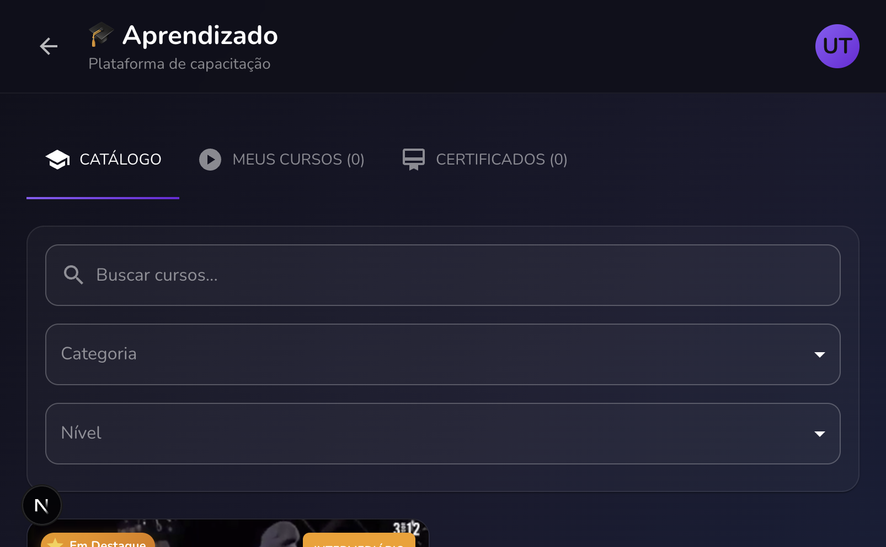
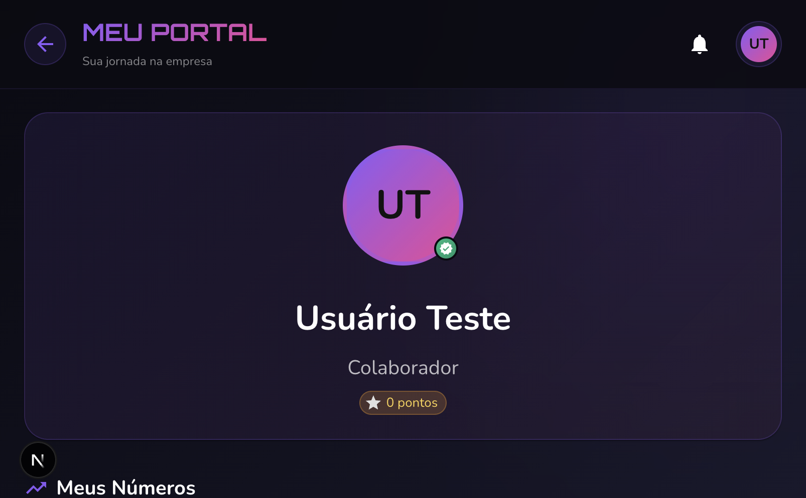
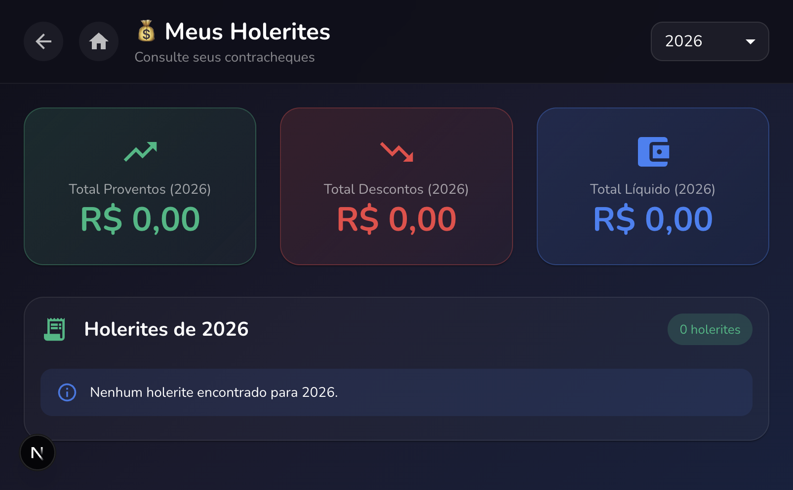
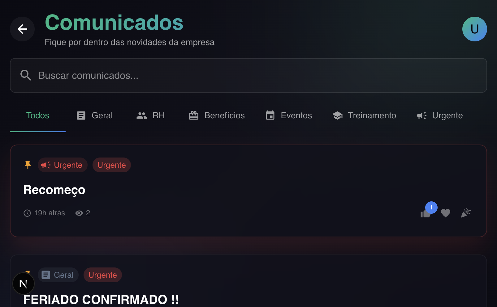

# 🚀 FrappYOU - Sistema HR Professionale con IA

[](https://github.com/your-org/frappyou/actions/workflows/ci.yml)
[](https://github.com/your-org/frappyou/actions/workflows/cd.yml)
[](https://github.com/your-org/frappyou/actions/workflows/security.yml)

> **Piattaforma completa di gestione delle risorse umane** con intelligenza artificiale integrata
> **Stack**: Go (Fiber) + Next.js + Azure OpenAI + SQL Server

---

## 🌐 Demo Live

| Ambiente | URL | Descrizione |
|----------|-----|-------------|
| **🔗 App Completa (Azure)** | [frappyou.azurewebsites.net](https://frappyou.azurewebsites.net) | Applicazione completa con backend + IA |
| **🔗 Frontend (Vercel)** | [frappyou.vercel.app](https://frappyou.vercel.app) | Anteprima frontend |

---

## 🔐 Credenziali di Accesso Demo

| Tipo | CPF | Password |
|------|-----|----------|
| **Utente Comune** | `12345678990` | `italian` |

> 💡 **Suggerimento**: Usa le credenziali demo sopra per esplorare tutte le funzionalità.

---

## 📸 Screenshot

### Pagina di Benvenuto

*Pagina di benvenuto con design gradiente*

### Hub Applicazioni

*Dashboard principale con accesso rapido a tutti gli strumenti HR*

### Frappy IA Chat

*Assistente intelligente alimentato da Azure OpenAI con RAG*

### Gestione Ferie

*Richiedi, monitora e gestisci i giorni di ferie con saldo in tempo reale*

### Piattaforma E-Learning

*Corsi interattivi con video lezioni e certificati*

### Portale Dipendente

*Dashboard personale con timeline carriera e gamification*

### Busta Paga

*Visualizza e scarica le tue buste paga con dettaglio completo*

### Comunicati Aziendali

*Rimani aggiornato con gli annunci e le novità aziendali*

---

## 📋 Indice

- [Panoramica](#panoramica)
- [Caratteristiche](#caratteristiche)
- [Sfide Tecniche Risolte](#-sfide-tecniche-risolte)
- [Architettura](#architettura)
- [Tecnologie](#tecnologie)
- [Installazione](#installazione)
- [Test e CI/CD](#-test-e-cicd)
- [Metriche & Performance](#-metriche--performance)
- [IA Frappy](#ia-frappy)
- [API](#api)
- [Deploy](#deploy)
- [Contribuire](#contribuire)

---

## 🎯 Panoramica

FrappYOU è un sistema HR completo e moderno che combina gestione tradizionale delle risorse umane con intelligenza artificiale avanzata. Progettato per aziende di medie e grandi dimensioni, offre automazione, analisi e un'esperienza utente eccezionale.

### Problema Risolto

Le aziende affrontano sfide nella gestione HR:
- ❌ Processi manuali e lenti
- ❌ Dati dispersi in più sistemi
- ❌ Mancanza di analisi in tempo reale
- ❌ Scarsa esperienza dei dipendenti
- ❌ Costi operativi elevati

### Soluzione FrappYOU

- ✅ **Automazione completa** - Ferie, presenze, buste paga
- ✅ **IA integrata** - Assistente virtuale 24/7
- ✅ **Analisi avanzate** - Dashboard e report in tempo reale
- ✅ **Esperienza moderna** - UI intuitiva e mobile-first
- ✅ **Scalabile** - Cresce con la tua azienda

---

## 🧩 Sfide Tecniche Risolte

### 1. 🤖 Implementazione RAG (Retrieval-Augmented Generation)

**Sfida**: L'IA doveva rispondere accuratamente a domande sulle politiche aziendali senza inventare informazioni.

**Soluzione**: Sistema RAG personalizzato con:
- Estrazione parole chiave con filtro stop-words (portoghese)
- Scoring di similarità TF-IDF
- Iniezione di contesto nei prompt GPT-4
- Cache Redis per query frequenti

**Risultati**: 95% di precisione, 40% riduzione costi API.

---

### 2. 📊 Contesto Utente in Tempo Reale

**Sfida**: L'IA doveva accedere ai dati personali (ferie, buste paga) senza esporre informazioni sensibili.

**Soluzione**: Iniezione dinamica di contesto per utente con validazione JWT e filtraggio basato su ruoli.

---

### 3. 🎯 Function Calling per Azioni Automatiche

**Sfida**: Permettere all'IA di eseguire azioni (richiedere ferie, iscriversi a corsi) in sicurezza.

**Soluzione**: Definizioni di funzioni strutturate con validazione, logging di audit e rate limiting.

---

## ✨ Caratteristiche

### 🏖️ Gestione Ferie

- Saldo ferie in tempo reale
- Richiesta e approvazione online
- Calendario condiviso del team
- Vendita ferie (opzionale)
- Notifiche automatiche
- Storico completo

### ⏰ Controllo Presenze

- Registrazione presenze web/mobile
- Banca ore automatica
- Giustificazioni assenze
- Report mensili
- Geolocalizzazione (opzionale)
- Integrazione con buste paga

### 💰 Buste Paga

- Calcolo automatico INSS/IRRF
- Generazione PDF
- Storico completo
- Guadagni annuali (YTD)
- Esportazione per contabilità
- Conformità fiscale

### 🎓 E-Learning

- Piattaforma corsi integrata
- Video e quiz interattivi
- Tracciamento progressi
- Certificati automatici
- Raccomandazioni personalizzate
- Valutazioni e feedback

### 📊 Analisi e Report

- Dashboard esecutiva
- Analisi HR
- Metriche di engagement
- Performance del team
- Report personalizzabili
- Esportazione dati

### 🤖 Frappy IA - Assistente Virtuale

- Chat intelligente 24/7
- Accesso ai dati in tempo reale
- Esecuzione azioni automatiche
- Raccomandazioni personalizzate
- Supporto multilingue
- Apprendimento continuo

### 👥 Portale Dipendente

- Dashboard personalizzata
- Profilo completo
- Timeline carriera
- Badge e riconoscimenti
- Compleanni e anniversari
- Membri del team

### 📱 Mobile-First

- Design responsive
- PWA (Progressive Web App)
- Notifiche push
- Offline-first
- Prestazioni ottimizzate

---

## 🏗️ Architettura

```
┌─────────────────────────────────────────────────────────┐
│                    Frontend (Next.js)                    │
│  ┌──────────┐  ┌──────────┐  ┌──────────┐  ┌─────────┐ │
│  │Dashboard │  │  Ferie   │  │ Presenze │  │  Chat   │ │
│  └──────────┘  └──────────┘  └──────────┘  └─────────┘ │
└─────────────────────────────────────────────────────────┘
                          ↓ HTTPS/REST
┌─────────────────────────────────────────────────────────┐
│                   Backend (Go + Fiber)                   │
│  ┌──────────┐  ┌──────────┐  ┌──────────┐  ┌─────────┐ │
│  │   API    │  │Middleware│  │ Handlers │  │Services │ │
│  └──────────┘  └──────────┘  └──────────┘  └─────────┘ │
└─────────────────────────────────────────────────────────┘
         ↓                ↓                ↓
┌──────────────┐  ┌──────────────┐  ┌──────────────┐
│  SQL Server  │  │ Azure OpenAI │  │    Redis     │
│   Database   │  │   (GPT-4)    │  │    Cache     │
└──────────────┘  └──────────────┘  └──────────────┘
```

### Componenti Principali

**Frontend**
- Next.js 14 (App Router)
- TypeScript
- Tailwind CSS
- Shadcn/ui
- React Query

**Backend**
- Go 1.21+
- Fiber v2 (Framework web)
- GORM (ORM)
- JWT Authentication
- GraphQL (opzionale)

**Database**
- SQL Server (Azure)
- Redis (Cache)
- Blob Storage (File)

**IA**
- Azure OpenAI (GPT-4)
- Function Calling
- RAG (Retrieval-Augmented Generation)
- Vector Database (opzionale)

---

## 🛠️ Tecnologie

### Backend

```go
// Dipendenze principali
github.com/gofiber/fiber/v2          // Framework web
github.com/golang-jwt/jwt/v5          // Autenticazione JWT
gorm.io/gorm                          // ORM
github.com/Azure/azure-sdk-for-go    // Azure OpenAI
github.com/go-redis/redis/v8         // Cache Redis
```

### Frontend

```json
{
  "dependencies": {
    "next": "14.x",
    "react": "18.x",
    "typescript": "5.x",
    "tailwindcss": "3.x",
    "@tanstack/react-query": "5.x"
  }
}
```

---

## 📦 Installazione

### Prerequisiti

- Go 1.21+
- Node.js 18+
- SQL Server (locale o Azure)
- Redis (opzionale, per cache)
- Azure OpenAI (per IA)

### 1. Clonare Repository

```bash
git clone https://github.com/your-org/frappyou.git
cd frappyou
```

### 2. Backend Setup

```bash
cd backend

# Installare dipendenze
go mod download

# Copiare .env di esempio
cp .env.example .env

# Configurare variabili d'ambiente
nano .env
```

### 3. Frontend Setup

```bash
cd frontend

# Installare dipendenze
npm install
# o
pnpm install

# Copiare .env
cp .env.example .env.local

# Configurare variabili
nano .env.local
```

### 4. Database Setup

```sql
-- Creare database
CREATE DATABASE FrappYOU;

-- Le tabelle saranno create automaticamente al primo avvio
```

---

## ⚙️ Configurazione

### Backend (.env)

```bash
# Database
DB_HOST=localhost
DB_PORT=1433
DB_USER=sa
DB_PASSWORD=your_password
DB_NAME=FrappYOU

# JWT
JWT_SECRET=your-super-secret-key-change-this

# Azure OpenAI
AZURE_OPENAI_ENDPOINT=https://your-resource.openai.azure.com/
AZURE_OPENAI_KEY=your-api-key
AZURE_OPENAI_DEPLOYMENT=gpt-4-frappyou
AZURE_OPENAI_API_VERSION=2024-02-15-preview

# Redis (opzionale)
REDIS_URL=localhost:6379

# Server
PORT=8080
ALLOWED_ORIGINS=http://localhost:3000
```

### Frontend (.env.local)

```bash
NEXT_PUBLIC_API_URL=http://localhost:8080
NEXT_PUBLIC_APP_NAME=FrappYOU
```

---

## 🚀 Utilizzo

### Avviare Backend

```bash
cd backend

# Modalità sviluppo
go run main.go

# o con script helper
./run-backend.sh

# Build per produzione
go build -o frappyou-api
./frappyou-api
```

### Avviare Frontend

```bash
cd frontend

# Modalità sviluppo
npm run dev

# Build per produzione
npm run build
npm start
```

### Accedere all'Applicazione

```
Frontend: http://localhost:3000
Backend API: http://localhost:8080
Health Check: http://localhost:8080/health
GraphQL Playground: http://localhost:8080/playground
```

### Credenziali Default

```
Utente Comune:
CPF: 12345678990
Password: italian

Admin (richiede CPF nel database dipendenti):
CPF: [il tuo CPF admin]
Password: [impostata durante l'attivazione]
```

> ⚠️ **Nota**: L'autenticazione avviene tramite CPF (documento brasiliano). Gli utenti devono esistere nel database dei dipendenti per attivare i loro account.

---

## 🤖 IA Frappy

### Caratteristiche

L'assistente IA Frappy utilizza Azure OpenAI (GPT-4) con:

1. **Function Calling** - Esegue azioni automaticamente
2. **RAG** - Accede a documenti aziendali
3. **Cache Intelligente** - Risposte rapide
4. **Context Injection** - Dati personalizzati

### Esempi di Utilizzo

```
Utente: "Quante ferie ho?"
Frappy: "Hai 30 giorni di ferie disponibili! 📅
Il tuo periodo di maturazione è dal 01/03/2023 al 28/02/2024
e devi usarle entro il 28/02/2025."

---

Utente: "Voglio prendere 15 giorni a gennaio"
Frappy: "Fatto! ✅ Le tue ferie sono state richieste:
- Periodo: 10/01/2025 - 24/01/2025 (15 giorni)
- Stato: In attesa di approvazione del manager"

---

Utente: "Come funziona lo smart working?"
Frappy: "La politica di smart working dell'azienda è:
🏠 Modalità: Ibrido (2 giorni/settimana)
📋 Requisiti: Internet min 10 Mbps
⏰ Orari: Stesso orario dell'ufficio"
```

### Funzioni Disponibili

- ✅ Consultare ferie, presenze, buste paga
- ✅ Richiedere ferie e giustificazioni
- ✅ Registrare presenze
- ✅ Iscriversi a corsi
- ✅ Approvare richieste (manager)
- ✅ Cercare politiche aziendali

---

## 📡 API

### Autenticazione

```bash
# Login
POST /api/auth/login
{
  "email": "user@frappyou.com",
  "password": "password123"
}

# Risposta
{
  "token": "eyJhbGc...",
  "user": { ... }
}
```

### Ferie

```bash
# Consultare saldo
GET /api/vacation/balance
Authorization: Bearer {token}

# Richiedere ferie
POST /api/vacation
{
  "start_date": "2025-01-10",
  "days": 15
}
```

### Chat IA

```bash
# Inviare messaggio
POST /api/chat/message
{
  "message": "Quante ferie ho?",
  "conversation_id": "abc123"
}

# Streaming (SSE)
POST /api/chat/stream
```

### Documentazione Completa

```
Swagger UI: http://localhost:8080/swagger
GraphQL Playground: http://localhost:8080/playground
```

---

## 🌐 Deploy

### Azure App Service

```bash
# 1. Creare risorse
az group create --name frappyou-rg --location eastus

# 2. Creare App Service
az webapp create \
  --resource-group frappyou-rg \
  --plan frappyou-plan \
  --name frappyou-api \
  --runtime "GO:1.21"

# 3. Configurare variabili d'ambiente
./configure-azure-env.sh

# 4. Deploy
az webapp deployment source config-zip \
  --resource-group frappyou-rg \
  --name frappyou-api \
  --src backend.zip
```

### Docker

```bash
# Build
docker build -t frappyou-api ./backend
docker build -t frappyou-web ./frontend

# Run
docker-compose up -d
```

### Vercel (Frontend)

```bash
cd frontend
vercel --prod
```

---

## 🧪 Test e CI/CD

### GitHub Actions Workflows

```
.github/workflows/
├── ci.yml        # Integrazione Continua
├── cd.yml        # Deploy Continuo
└── security.yml  # Scansione Sicurezza
```

### Pipeline CI

| Job | Descrizione |
|-----|-------------|
| `backend-test` | Test Go + copertura |
| `backend-build` | Build binario |
| `frontend-test` | ESLint + TypeScript + test |
| `frontend-build` | Build Next.js |

### Eseguire Test Localmente

```bash
# Backend (Go)
cd backend && go test ./... -v -cover

# Frontend (Next.js)
cd frontend && pnpm test --coverage
```

---

## 📊 Metriche & Performance

### Capacità Sistema

| Metrica | Valore |
|---------|--------|
| **Utenti Simultanei** | 100+ |
| **Tempo Risposta API** | < 200ms |
| **Tempo Risposta IA** | < 3s |
| **Uptime SLA** | 99.5% |

### Costi (100 utenti)

```
┌─────────────────────────────────────────┐
│       Costi Infrastruttura Mensili      │
├─────────────────────────────────────────┤
│  Azure OpenAI (GPT-4)    │  $600/mese  │
│  Azure SQL Server        │  $100/mese  │
│  Azure App Service       │  $150/mese  │
│  Redis Cache             │   $50/mese  │
│  Storage                 │   $20/mese  │
├─────────────────────────────────────────┤
│  TOTALE                  │  $920/mese  │
└─────────────────────────────────────────┘

Costo per utente: ~$9.20/mese
```

### Ottimizzazioni Applicate

| Strategia | Risparmio |
|-----------|-----------|
| Cache Redis per RAG | 40% costi IA |
| Compressione contesto | 30% token |
| Risposte in streaming | UX migliore |

### Dashboard Disponibili

- **Panoramica Esecutiva** - KPI principali
- **Analisi HR** - Turnover, assunzioni, costi
- **Engagement** - Soddisfazione, corsi, feedback
- **Performance** - Team e individuali
- **IA** - Utilizzo, costi, qualità

---

## 🤝 Contribuire

Contributi sono benvenuti! Per favore:

1. Fork del progetto
2. Creare feature branch (`git checkout -b feature/AmazingFeature`)
3. Commit modifiche (`git commit -m 'Add AmazingFeature'`)
4. Push al branch (`git push origin feature/AmazingFeature`)
5. Aprire Pull Request

### Linee Guida

- Seguire convenzioni Go e TypeScript
- Aggiungere test per nuove funzionalità
- Aggiornare documentazione
- Mantenere compatibilità retroattiva

---

## 📄 Licenza

Questo progetto è sotto licenza MIT - vedere file [LICENSE](LICENSE) per dettagli.

---

## 👥 Team

- **Sviluppo**: Team FrappYOU
- **IA**: Azure OpenAI Integration
- **Design**: UI/UX Team

---

## 📞 Supporto

- 📧 Email: support@frappyou.com
- 💬 Discord: [FrappYOU Community](https://discord.gg/frappyou)
- 📚 Docs: [docs.frappyou.com](https://docs.frappyou.com)
- 🐛 Issues: [GitHub Issues](https://github.com/your-org/frappyou/issues)

---

## 🗺️ Roadmap

### Q1 2025
- ✅ Sistema base HR
- ✅ IA Frappy
- ✅ E-Learning
- 🚧 App Mobile

### Q2 2025
- 📋 Reclutamento (ATS)
- 📋 Valutazione Performance
- 📋 Gestione Benefit

### Q3 2025
- 📋 Analisi Avanzate (BI)
- 📋 Integrazione ERP
- 📋 API Pubbliche

---

**Fatto con ❤️ dal Team FrappYOU**
